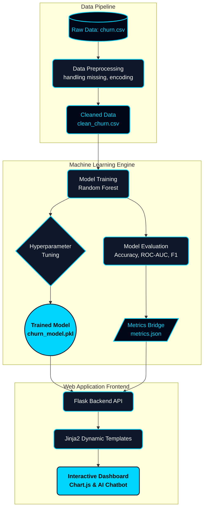

<div align="center">


**An enterprise-grade, end-to-end Machine Learning web application designed to predict customer churn and provide actionable retention intelligence.**

[](https://www.python.org/)
[](https://flask.palletsprojects.com/)
[](https://scikit-learn.org/)
[](https://pandas.pydata.org/)
<br>
[]()
[]()
[]()
<br><br>
[]()
[](https://opensource.org/licenses/MIT)

</div>

<br />

## 🌟 Executive Summary

ChurnGuard AI is a comprehensive **Decision Support System (DSS)** integrating a powerful Random Forest machine learning pipeline with a dynamic, responsive Flask frontend. It is designed to process raw telecommunications customer data, identify high-risk accounts, and provide business intelligence through an interactive dashboard.

---

## ✨ Core Capabilities

- 🧠 **Advanced ML Pipeline:** Fully automated data preprocessing, stratified train/test splitting, and hyperparameter tuning to handle severe class imbalances.
- ⚡ **Predictive Engine:** Utilizes a highly tuned `RandomForestClassifier` (achieving ~77% Accuracy and 0.83 ROC-AUC) to generate real-time churn probabilities.
- 🔗 **Dynamic JSON Bridge:** The frontend and backend are decoupled. Python ML scripts export live metadata and evaluation metrics to JSON, which the Flask server dynamically renders in the UI.
- 🤖 **Interactive AI Assistant:** A built-in, context-aware Chatbot that can answer questions about model accuracy, navigate the dashboard, and provide quick suggestions.
- 🛡️ **Defensive Programming:** Implements robust `pandas.reindex` logic to ensure the web form never crashes the ML model, even if input features are missing.

---

## 🛑 CORE ARCHITECTURE (THE PIPELINE)

The system is built on a decoupled architecture where the Machine Learning pipeline operates independently of the Flask web server, connected via JSON metadata bridges.



---

## 💻 Enterprise Dashboard Features

<details>
<summary><b>🖼️ Click to expand UI Features</b></summary>
<br>

- **Dark-Mode Glassmorphism UI:** A stunning, modern interface with neon-cyan accents.
- **Live Visualizations:** Powered by Chart.js for interactive business telemetry.
- **Audience Insights:** Ranks top 20 highest-risk customers and calculates Lifetime Value (LTV).
- **Model Configuration Hub:** Real-time visibility into ML hyperparameter details and pipeline health.

</details>

---

## 🚀 Quick Start Guide

### 1. Clone the repository
```bash
git clone https://github.com/hetvi-prajapati/customer-churn-prediction.git
cd customer-churn-prediction
```

### 2. Install dependencies
It is highly recommended to use a virtual environment.
```bash
python -m venv venv
source venv/bin/activate  # On Windows use: venv\Scripts\activate
pip install -r requirements.txt
```

### 3. Run the ML Pipeline (Optional but recommended)
Train the model and generate fresh metric files based on `data/raw/churn.csv`:
```bash
python main.py
```

### 4. Start the Web Server
Launch the Flask dashboard to interact with the predictive engine:
```bash
python app/app.py
```
> 🌐 Navigate to `http://localhost:5001` in your browser.

---

<div align="center">
  <p>Built with ❤️ by Hetvi Prajapati</p>
</div>
